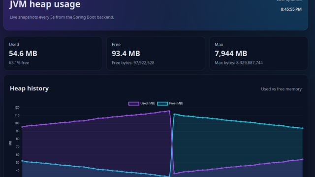
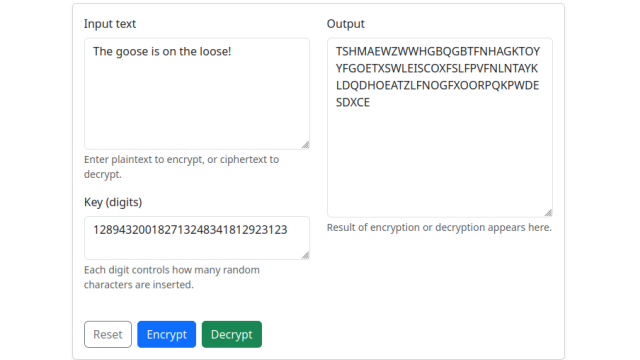
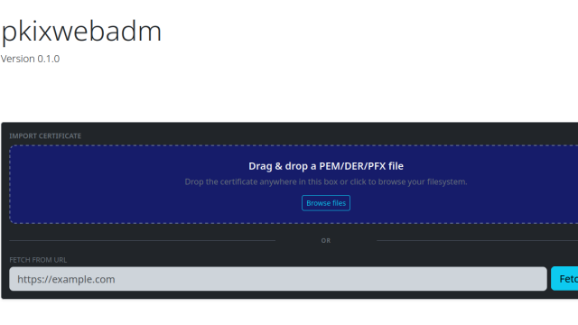
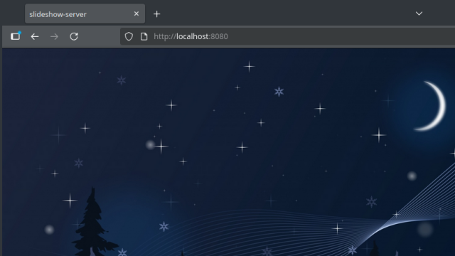
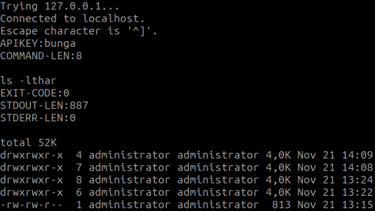
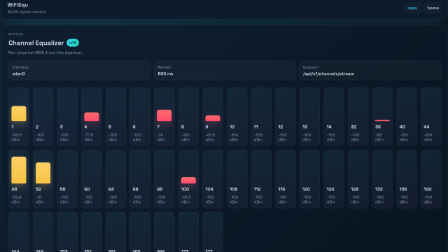

# cv-samples

A compact portfolio of small, self‑contained code projects that complement my CV. Each folder contains either a standalone app or a minimal library with examples and tests. The focus is clarity, correctness, and cross‑language thinking. Projects are developed in their own staging repositories before they are published here, so every sample arrives with its build scripts, docs, and local checks already exercised.

> Live previews and links: [**cv‑samples.vercel.app**](https://cv-samples.vercel.app)

[](../../actions)


## About me
I’m a software engineer who enjoys building neat, well‑scoped utilities and visual demos across languages (C/C++, C#, Java, Python, TypeScript/JavaScript, and Angular). I care about readable code, reproducible builds, and pragmatic architecture.

## Projects

| Project | What it is | Primary skills |
|---|---|---|
| **[heapmonj](https://github.com/dentonescu/cv-samples/tree/main/heapmonj)** | JVM heap monitor microservice (Spring Boot 4/Java 21) with scheduled sampling to H2 and an Angular + Chart.js frontend. | Java 21, Spring Boot, JPA/H2, Angular, Docker |
| **[libdmotservices](https://github.com/dentonescu/cv-samples/tree/main/libdmotservices)** | Personal multi‑language utility library with unit tests and examples. | C, Java, Python, JavaScript, Cross-language build tooling |
| **[null-cipher](https://github.com/dentonescu/cv-samples/tree/main/null-cipher)** | Single‑page visual demo of a simple cipher (encrypt/decrypt) in the browser. | JavaScript, HTML, CSS, Bootstrap UI |
| **[pkixwebadm](https://github.com/dentonescu/cv-samples/tree/main/pkixwebadm)** (HTTP foundation in progress) | Certificate inventory web app pairing FastAPI with SQLite; configuration and scaffold are in place while the app factory and landing page are being implemented. | Python, FastAPI, Bootstrap UI, vendored JS tooling |
| **[slideshow-server](https://github.com/dentonescu/cv-samples/tree/main/slideshow-server)** | Tiny Python web server that generates responsive media slideshows. | Python, HTML, JS, Docker |
| **[triangle-peg-game-react](triangle-peg-game-react/README.md)** (in progress) | React SPA of the triangular peg solitaire game: interactive board, legal-move highlighting, undo/reset, responsive UI, Vercel-ready build; ships with a Python precompute helper and `states.json`. | React, Vite, TypeScript/JavaScript, HTML/CSS, Python (helpers) |
| **[txrxcli](https://github.com/dentonescu/cv-samples/tree/main/txrxcli)** | Educational raw‑TCP remote execution demo with a C++ Linux client/server and a C#/.NET dual‑mode peer; API‑key gated, warning‑heavy, not for production. | C++17 sockets, process exec/capture, C#/.NET 8 |
| **[WiFiEqu](https://github.com/dentonescu/cv-samples/tree/main/wifiequ)** (in progress) | Terminal Wi‑Fi channel “equalizer” visualizer with a C JSON daemon, Windows service, and Angular web UI. The Linux daemon streams live/mock readings over SSE, honours configurable refresh cadences, and secures `/api/v1/stats` with an API key. | C, ANSI/terminal, JSON APIs, C#, Angular, Docker |

## Gallery

| heapmonj | libdmotservices | null-cipher |
|---|---|---|
| [](heapmonj/README.md) | [](libdmotservices/README.md) | [](null-cipher/README.md) |

| pkixwebadm | slideshow-server | triangle-peg-game-react |
|---|---|---|
| [](pkixwebadm/README.md) | [](slideshow-server/README.md) | [](triangle-peg-game-react/README.md) |

| txrxcli | WiFiEqu | Terraglean |
|---|---|---|
| [](txrxcli/README.md) | [](wifiequ/README.md) | [](docs/terraglean.md) |


## Tooling & automation
- `dev.sh` in the repository root orchestrates dependency setup, builds, tests, installs, and demo runs from a single entrypoint. It now recognises mock vs. hardware example runs, optional interface overrides, and selective subcommands so you can rehearse exactly what the CI job performs. See the usage recipes below for common scenarios. The `--install-deps` slice now installs Node.js so libdmotservices’ JavaScript helpers and tests run consistently in CI and locally.
- `.github/workflows/cv-samples-ci.yml` mirrors the `dev.sh` flow on GitHub Actions: dependencies → build → tests → example runs. The pipeline ensures every project stays buildable on a clean Ubuntu runner (the Wi-Fi scan demo skips gracefully when no wireless interface is available).
- `docker-compose.yml` spins up containerised demos (`stack-index` on host port `8080`, `heapmonj-backend` on `8081`, `heapmonj-frontend` on `8082`, `null-cipher` on `8083`, `pkixwebadm` on `8084`, `slideshow-server` on `8085`, `triangle-peg-game-react` on `8086`, `wifiequ-backend` on `8087`, `wifiequ-frontend` on `8088`) using the project-specific Dockerfiles. Great for a one-command tour: `docker compose up --build`. See [Docker stack notes](docker/README.md) for the full command list, group permissions, and snap service tips.
- `.gitattributes` files have been introduced across the projects to normalise line endings and enforce consistent attributes, making diffs reliable across platforms.
- All major projects now ship CMakeLists alongside their original Make/Ant flows. A typical configure/build is `cmake -S <project> -B <project>/build -G Ninja && cmake --build <project>/build` with target names that mirror the Makefile habits (`*_dist`, `*_test`, example/demo helpers).

### `dev.sh` quick recipes
```bash
sudo ./dev.sh --install-prj
```
Installs `/etc/wifiequd.conf`, generates an API key, stages the systemd unit, and copies binaries into `/usr/local/bin`. Run whenever you want the WiFiEqu daemon and demos on the host system.

```bash
sudo ./dev.sh --run-examples
```
Rebuilds and launches the demos in live hardware mode (defaults to `wlan0`; pair with `--iface <name>` to override).

```bash
./dev.sh --run-tests
```
Compiles and executes the unit-test suites without touching system directories.

```bash
sudo ./dev.sh --install-deps --install-prj --build --run-tests --run-examples
```
“Full treatment” run that matches the CI workflow: apt dependencies (includes gtest/spdlog/fmt for txrxcli tests), rebuild, install, unit tests, and demos.

```bash
sudo ./dev.sh --iface wlp2s0 --install-deps --install-prj --build --run-tests --run-examples
```
Same as above but pinned to a specific wireless interface.

```bash
./dev.sh --mock --run-examples
```
Skips demos requiring live hardware by setting mock mode. Handy for CI or headless hosts where no Wi-Fi device is exposed.

## How to use this repository
- Every project folder has its own `README.md` with quick build or run instructions.
- The shared documentation hub in [`docs/`](docs/README.md) links to deeper design notes (future work, Terraglean concept, prng-tools lab) so you can navigate without hunting through folders.
- Prefer the Docker Compose workflow when you want to try the demos without installing runtimes directly. Install Docker (snap instructions included in [docker/README.md](docker/README.md)), run `docker compose up --build`, then visit `http://localhost:8080` (stack index), `http://localhost:8081` (heapmonj API), `http://localhost:8082` (heapmonj UI), `http://localhost:8083` (null-cipher), `http://localhost:8084` (pkixwebadm), `http://localhost:8085` (slideshow), `http://localhost:8086` (triangle peg game), `http://localhost:8087` (WiFiEqu API), and `http://localhost:8088` (WiFiEqu web UI). Use `docker compose down` when you're done. The default WiFiEqu stats token is baked into compose for convenience; change it in `docker-compose.yml` if desired.
- Prefer `./dev.sh --install-deps --install-prj --build --run-tests --run-examples` for the full local check, or run the corresponding CI workflow manually from the Actions tab if you want to watch the hosted logs.
- Code is intentionally small and instructional—suited for reading and discussion.
- Nothing here is used in production customer systems.

## License
All content is provided under the license in `/LICENSE`. You’re free to read and learn from the code. If you use parts of it, please include attribution.


---

Check back regularly — new samples will be added and existing ones improved as the gallery evolves.

## Upcoming work
- Current priority: **triangle-peg-game-react** is under active development this week; see the project entry above for details.
- **pkixwebadm**: extend the new security scaffolding with live ingestion APIs, add UI validation/feedback, and land CSRF + server-side MIME checks before circling back to container packaging.
- **WiFiEqu**: prototype the Windows worker that mirrors the Linux API, factor shared DTO/config plumbing into a reusable C# library, and round out the Docker Compose story with health checks and metrics before pursuing CI/CD builds.
- **Terraglean**: now tracked in [docs/terraglean.md](docs/terraglean.md); once WiFiEqu stabilises, kick off the Spring Boot/Micronaut service spike, persistence plan, and UI exploration documented there.
- **Portfolio glue**: continue aligning DevOps expectations—multi-language builds, container images, and cross-project Compose entries—so each sample can graduate from `_private_staging` once the future work above solidifies.


## Research incubator: prng-tools
`prng-tools` is a long-horizon lab for studying pseudorandom number generators (PRNGs), entropy sources, and cryptographically secure randomness across languages and optional hardware. The motivation is simple curiosity: how random are the stock generators in C, Python, Java, C#, Rust, etc., how does their secure API behave across platforms, and how can one quantify and visualise those differences reproducibly? The project will live inside this repo once the early prototypes settle; for now this README captures the intent and [docs/future_work.md](docs/future_work.md) holds the deeper roadmap.
