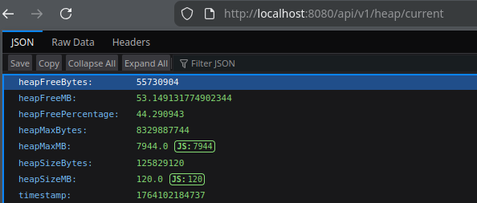
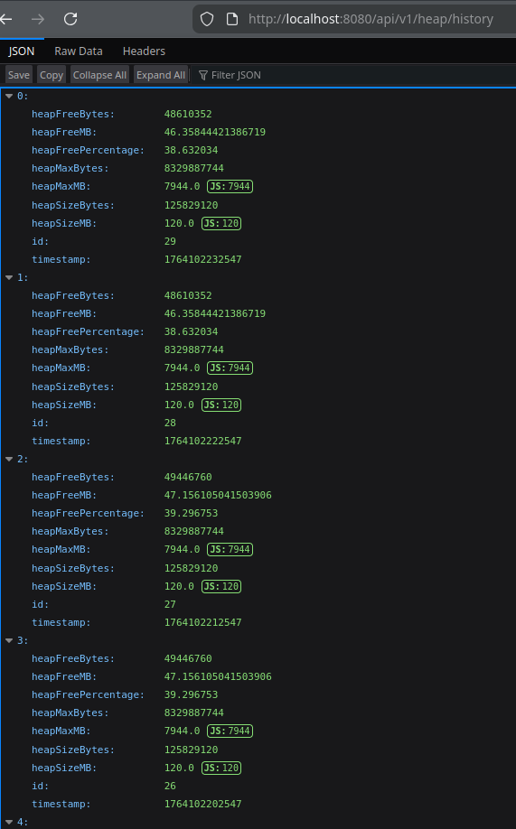

# Developer notes (backend)

## Current layout
```
backend/
  heapmonj/
    build.gradle
    settings.gradle
    src/
      main/java/dev/dmotservices/heapmonj/
        HeapmonjApplication.java
        dto/HeapStatus.java
        entity/HeapSample.java
        repository/HeapSampleRepository.java
        service/HeapInfoService.java
        scheduler/HeapSampleScheduler.java
        controller/HeapController.java
      main/resources/application.properties
      test/java/dev/dmotservices/heapmonj/
        PojoTests.java
        HeapmonjApplicationTests.java
        HeapSampleRepositoryTests.java
```

## Implementation plan & stage
- **Heap snapshot DTO**: `HeapStatus` present with static `now()` snapshot (done).
- **Persistence**: `HeapSample` JPA entity + `HeapSampleRepository` (done).
- **Service layer**: `HeapInfoService` maps libdmotservices `HeapInfo` to DTO/entity (done).
- **REST API**: `/api/v1/heap/current` and `/api/v1/heap/history` with `limit`/`since` (done).
- **Scheduling**: 10s sampler persisting to H2 (done; configurable via `heapmonj.sampling.interval-ms`).
- **Packaging**: Dockerfile and docker-compose with frontend, CI workflow (pending).
- **Frontend integration**: Angular polling/Chart.js UI once frontend is scaffolded (pending).

## Build notes
- Requires JDK 21. Gradle toolchain is set to 21; ensure your environment/daemon uses it.
- `./gradlew build` runs libdmotservices version stamping and `mvn -DskipTests install` before compiling.
- Tests may be marked UP-TO-DATE; use `./gradlew test --rerun-tasks` to force execution.
- H2 configured for on-disk storage at `data/` relative to the backend project (gitignored).
- H2 console is disabled (`spring.h2.console.enabled=false`); use JDBC directly to inspect.

## H2 shell

`tools/h2-shell.sh` opens a shell which can be used to issue commands against the H2 database. Use the in-memory test profile for tests; on-disk DB lives under `data/` for runtime.

## Heap sample scheduler

By default, a heap sample is captured and persisted every 10 seconds. This setting (`heapmonj.sampling.interval-ms`) is configured in `application.properties`.

## REST API endpoints in action

/api/v1/heap/current:




/api/v1/heap/history:


