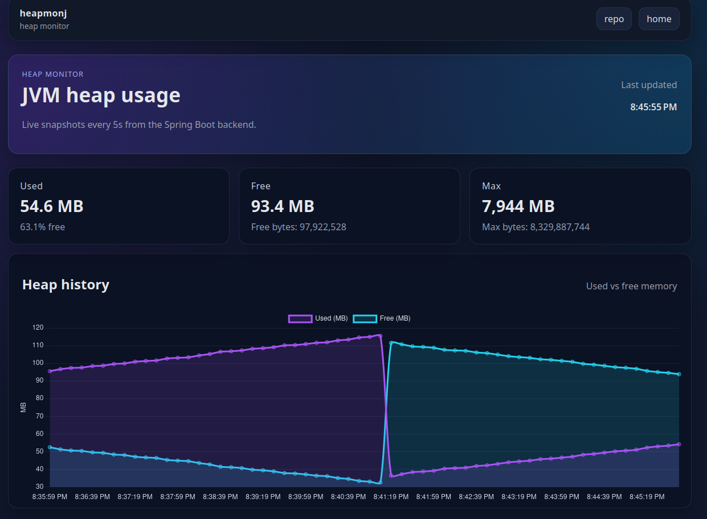

# heapmonj Frontend Notes

- **Stack:** Angular 21 (standalone components), RxJS, Chart.js 4 via ng2-charts, SCSS.
- **Dev start:** `cd heapmonj/frontend/heapmonj-frontend && npm install && ng serve --proxy-config proxy.conf.json` (serves on `http://localhost:4200`, proxies `/api` to backend on `http://localhost:8080`).
- **Build/tests:** `npm run build` (prod bundle), `npm test` (unit tests).
- **Config:** `src/app/config.ts` holds `pollIntervalMs` and `historyLimit`; endpoints centralized in `src/app/api/endpoints.ts`; proxy in `proxy.conf.json`.
- **UI:** Heapmon view polls `/api/v1/heap/current` and `/history`, shows summary cards and a live chart (Chart.js) with non-animated updates to avoid jumpiness.
- **Docker:** `heapmonj/frontend/Dockerfile` builds the Angular app and serves via nginx; `/api` is proxied to `heapmonj-backend` in compose. Compose maps host `8084 -> 80`.
- **Networking:** In Docker Compose, the backend is reachable as `http://heapmonj-backend:8080` from the frontend (service names are DNS entries on the compose network), so no CORS is needed.
- **Screenshot:** 
