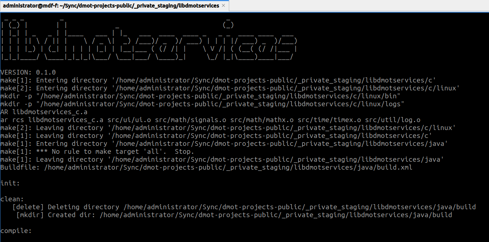

# libdmotservices

**libdmotservices** is my personal multi-language code library — a curated collection of small, reusable utilities written in **C** and **Java** (with more languages to come).  
It showcases how I approach **cross-language API design**, **version management**, and **clean software architecture** across ecosystems.

## Project Summary
This project demonstrates my ability to:
- Design modular, testable libraries in multiple languages.
- Centralize versioning across heterogeneous builds using a top-level `Makefile` and `VERSION` file.
- Automate builds, tests, and examples for consistency and reproducibility.
- Write maintainable documentation aimed at clarity and professional presentation.

## Structure
| Path | Description |
|------|--------------|
| `c/` | Portable C modules (signals, logging, terminal equalizer). |
| `java/` | Java modules (`dmot-core` and `dmot-servlet-javax`) with Ant/Maven builds. |
| `VERSION` | Central version file used across all subprojects. |
| `Makefile` | Top-level orchestrator that builds, tests, and runs examples across languages. |

## Highlights
- Portable codebases: compiles cleanly across Linux systems.
- Full test coverage with CMocka (C) and JUnit (Java).
- Minimal dependencies and clear build instructions.
- API-first mindset: code is structured for reusability and clarity.

## Build Overview
```bash
# Build everything (C + Java)
make clean all

# Run tests and examples
make test
make example-demo
```

Each subproject can also be built individually from its directory.

## What this demonstrates
- Cross-language integration and build orchestration.
- A disciplined, maintainable approach to multi-language software design.
- Documentation and automation skills relevant to API development roles.


## Why this exists

This repo collects tiny, battle-tested snippets I reach for repeatedly.  
They’re intentionally small, readable, and dependency-light to work well as CV samples.

## Screenshot



## Status

Active work-in-progress. APIs may evolve. Each subproject has its own README with build instructions.

---
**License:** [MIT](LICENSE)