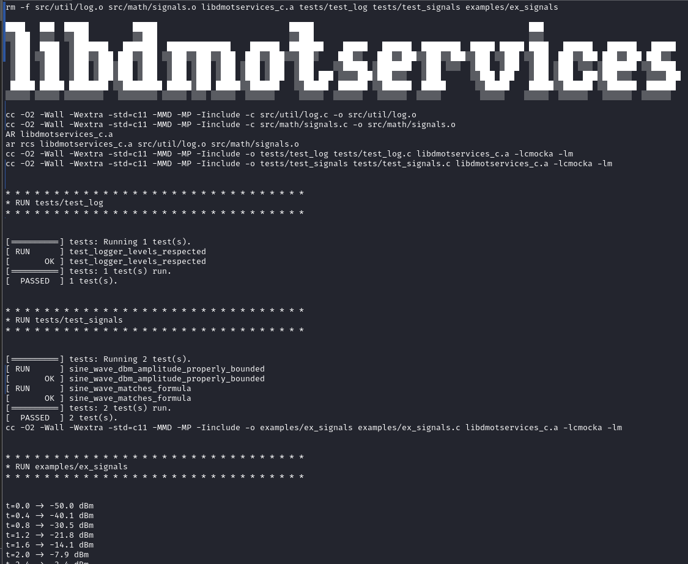

# libdmotservices (C/Linux)

A Linux-focused static C library built on **libdmotservices-c**, featuring signal utilities, logging, and a text-mode equalizer demo.

## Project Summary
This module demonstrates my ability to:
- Deliver robust Linux command-line applications.
- Manage platform-specific builds using `make`.
- Apply modular software engineering principles in C.

## Highlights
- Static library: `libdmotservices_c.a`
- Unit tests: CMocka framework
- Equalizer demo: multithreaded, smooth visual feedback
- Designed for clarity and performance

## Build Prerequisites
```bash
sudo apt update
sudo apt install -y build-essential libcmocka-dev
```

## Build & Run
```bash
make clean all      # builds the static library
make tests          # builds test binaries
make examples       # builds example binaries
make test           # runs unit tests
make example-demo   # runs example demos
```

## What this demonstrates
- Confident use of GNU toolchains and build automation.
- Test integration in native Linux environments.
- Hands-on understanding of signal processing and visualization in C.


## Screenshot



## Examples

[Examples](examples/README.md)