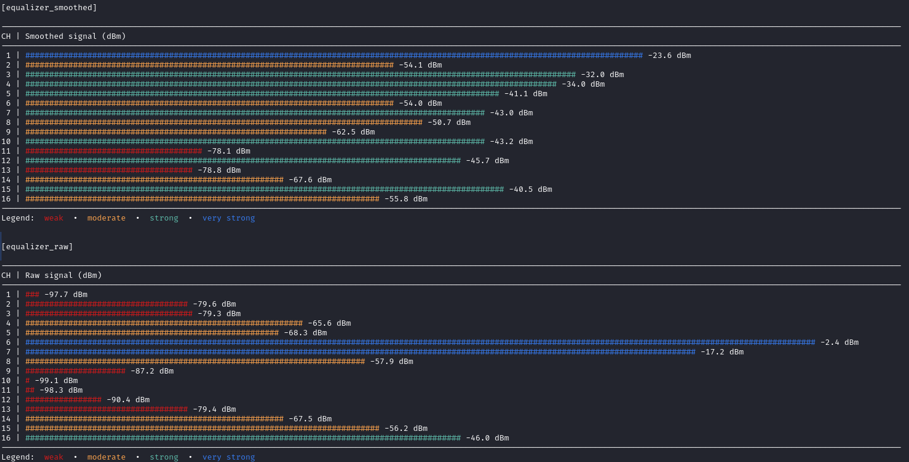

# libdmotservices (C/Linux Examples)

Runnable demos built on **libdmotservices-c**.

## Project Summary
This section demonstrates my ability to:
- Create educational, testable examples to illustrate library behavior.
- Present output in readable, visually engaging formats.
- Write maintainable and platform-independent C demo programs.

## Examples
| Example | Description |
|----------|--------------|
| `ex_signals` | Generates mock sine-wave signal data. |
| `ex_ui` | Minimal UI rendering test using ANSI sequences. |

## Run
```bash
cd bin
./ex_signals
./ex_ui
```

All examples are self-contained and depend only on the static library.

## What this demonstrates
- Interactive terminal programming in C.
- Educational demos for technical interviews or client presentations.
- Portability-focused development mindset.

## Screenshot



## Related

- Back to [Linux build](../README.md)
- Equalizer in action inside [WiFiEqu](../../../../wifiequ/linux/README.md)
