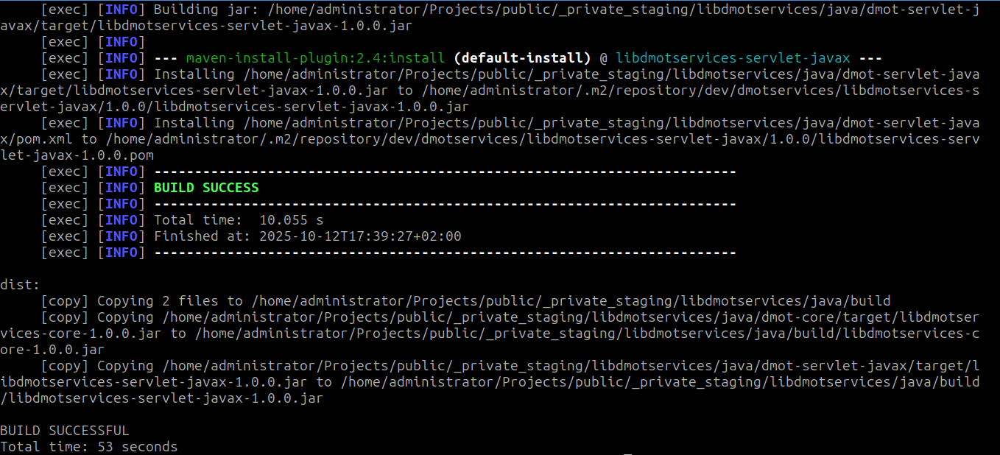

# libdmotservices (Java)

Small, reusable Java utilities I’ve built and refined over time.
The repository is organized as Maven modules but orchestrated by Ant for convenience
(artifact collection, filesystem moves, and centralized `${revision}` propagation).

**Java baseline:** 17 (compiled with `--release 17`)

## Modules

- **[dmot-core](dmot-core)**: Dependency-light core utilities (I/O, time, URIs, regex, collections).
- **[dmot-servlet-javax](dmot-servlet-javax)**: Legacy servlet helpers targeting `javax.servlet` 3.1
  (kept separate from the core module).

> Jakarta note: modern stacks (e.g., Spring Boot 3+) use `jakarta.servlet`.
> This repository isolates the `javax` functionality; a Jakarta variant may be added later.

## Build & versioning

You can build with Maven directly **or** via the Ant wrapper.

**Ant (preferred orchestrator)**
```bash
ant -Dant=/usr/bin/ant -Dmvn=/usr/bin/mvn -Dproject.java.home=/usr/lib/jvm/java-17-openjdk-amd64
```

### Screenshot


