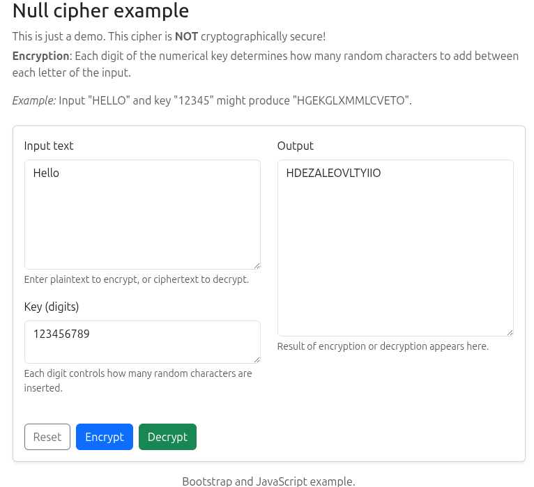

# null-cipher

Single-page app that encrypts and decrypts text using a variant of the null (concealment) cipher. Built for readability and quick experimentation.

[Live preview](https://cv-samples.vercel.app/null-cipher)

## Screenshot

## Related

- Developer notes: [NOTES.md](NOTES.md)
- Back to [portfolio overview](../README.md)
