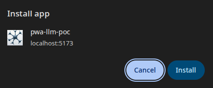

# Developer notes

Personal notes for the PWA + LLM proof of concept. This document tracks the plan, current status, and the rationale behind design choices.

## Current status
- MVP complete: installable PWA, Flask backend, Ollama integration, Docker stack wiring.

## Implementation plan
This is the scoped plan for the project as it evolves. Completed items are marked to keep the progress readable.

### Phase 1 — Core PWA + UI (done)
- ✅ Vite React + TypeScript scaffold.
- ✅ Single‑page prompt/response UI.
- ✅ Manifest + service worker for installability.
- ✅ App shell caching for offline‑limited behavior.

### Phase 2 — Backend + LLM (done)
- ✅ Flask API at `/api/v1/generate`.
- ✅ Ollama integration with a human‑readable response.
- ✅ Timeouts and error handling on both sides.

### Phase 3 — Stack & tooling (done)
- ✅ Dockerfiles for frontend/backend.
- ✅ Root Docker Compose wiring with sequential ports.
- ✅ Stack index updated with Ollama requirements.


## Timeline (rough)
- **January 2026**: MVP implementation and Docker wiring.

## File layout (current)
```
pwa-llm-poc/
  api/
    openapi.yaml
  backend/
    app.py
    config.py
    llm.py
    requirements.txt
  docs/
    openapi.html
  frontend/
    llm-spa/
      public/
      src/
  img/
  run-pwa-llm.sh
```

## Design notes
- The backend returns human‑readable text instead of strict JSON validation to keep the demo approachable.
- Ollama runs on the host; containers reach it via `host.docker.internal:11434`.
- Service worker caches the shell only; offline support is intentionally minimal.

## Screenshots

### PWA installation



