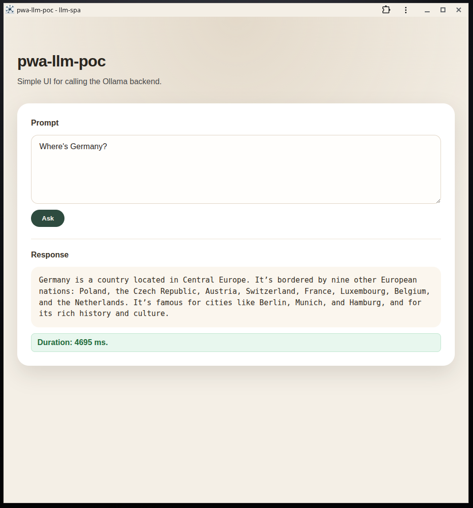

# pwa-llm-poc
Minimal installable PWA with a Flask + Ollama backend. The frontend is a small prompt/response UI and the backend calls a local Ollama model to generate human‑readable answers.

## What this project demonstrates
- Installable PWA basics (manifest, service worker, standalone display).
- Clean separation between frontend and backend.
- LLM integration with timeouts, error handling, and minimal, human‑readable responses.

## Quickstart (local dev)
Prereqs:
- Node.js + npm
- Python 3
- Ollama running locally with a model pulled (see below)

Backend:
```bash
cd backend
python3 app.py
```

Frontend:
```bash
cd frontend/llm-spa
npm install
npm run dev
```

The frontend uses a Vite proxy to reach `/api/v1/generate` on the backend during local dev.

## Ollama setup (required)
The backend expects Ollama on `http://localhost:11434` (or `OLLAMA_URL` if overridden).

```bash
ollama pull gemma3
OLLAMA_HOST=0.0.0.0:11434 ollama serve
```

The `OLLAMA_HOST=0.0.0.0:11434` bind is required for Docker containers to reach the host Ollama service.

## Docker (host Ollama)
This project’s Docker setup assumes Ollama runs on the host and is reachable at `host.docker.internal:11434`.

From the repository root:
```bash
docker compose up --build
```

Ports (default stack):
- Frontend: `http://localhost:8086`
- Backend: `http://localhost:8085/api/v1/generate`

## Convenience runner
For local development, `run-pwa-llm.sh` starts both the backend and the frontend and tails their logs:

```bash
./run-pwa-llm.sh
```

Logs are written to `logs/backend.log` and `logs/frontend.log`.

## API contract
- OpenAPI spec: [api/openapi.yaml](api/openapi.yaml)
- Generated HTML (after `make docs`): [docs/api/index.html](docs/api/index.html)

## Offline note
The service worker currently caches only the app shell (HTML, manifest, icons).
The built JS/CSS are not precached, so offline support is limited to the shell.

## Project docs
- [Developer notes](NOTES.md)
- [Backend README](backend/README.md)
- [Frontend README](frontend/README.md)
- [API README](api/README.md)
- [Docs README](docs/README.md)

## Screenshots


