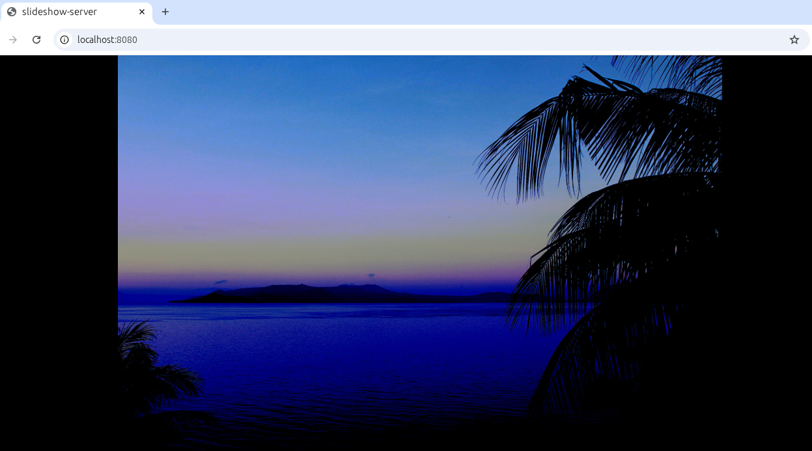

# slideshow-server

This Python program, **`slideshow-server`**, sets up an HTTP server that displays a slideshow of media files from a specified directory.

The application features a responsive design: images and videos are automatically resized to fit the width of the device displaying the content.

It supports interaction through keyboard, mouse, and touchscreen gestures such as taps and swipes.

Example usage:
```bash
python3 slideshow-server.py publicdomainpictures.net/
```

## Screenshot

