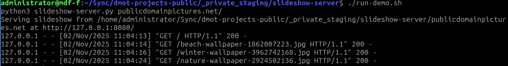

# slideshow-server

`slideshow-server` is a single-file HTTP service that renders a responsive slideshow from a local media directory. Images and videos are reshuffled on each launch, scaled to the current viewport, and can be navigated with keyboard, mouse, or touch gestures.

## Quick start

```bash
python3 slideshow-server.py publicdomainpictures.net/
```

Open the printed URL (defaults to `http://127.0.0.1:8080/`) in any modern browser. For a one-liner demo with bundled sample media run:

```bash
./run-demo.sh
```

## Command options

| Flag | Description | Default |
| --- | --- | --- |
| `media_dir` | Root directory scanned for images/videos. | _(required)_ |
| `--context` | URL context path served by the app. | `/` |
| `--bind_address` | Address passed to `HTTPServer`. Use `0.0.0.0` for LAN access. | `127.0.0.1` |
| `--port` | Listening port. | `8080` |
| `--interval` | Slide refresh interval (milliseconds). | `5000` |

Videos are streamed through `ffmpeg`. Ensure it is installed when serving formats that require transcoding.

## Makefile targets

| Target | Purpose |
| --- | --- |
| `make` / `make all` | Prints the ASCII logo and compiles bytecode into `build/`. |
| `make build` | Rebuilds the `.pyc` bundle without touching docs or dist. |
| `make test` | Runs the pytest suite in `tests/`. |
| `make dist` | Produces `dist/slideshow-server-<version>.tar.gz` with sources, assets, bytecode, and demo script. |
| `make clean` | Removes `build/` and `dist/` plus any stray `.pyc` files. |

Run `make dist` before packaging or publishing artifacts. The root `Makefile` gathers the resulting tarball automatically.

## Project layout

- [`slideshow_server/`](slideshow_server/README.md) — reusable package powering the CLI and tests.
- [`tests/`](tests/README.md) — pytest-based unit tests and helpers.
- [`img/`](img/README.md) — screenshots for documentation.
- [`publicdomainpictures.net/`](publicdomainpictures.net/README.md) — sample public-domain media used by the demo script.

Every directory links back here so you can navigate the docs without guesswork.

## Development workflow

```bash
python3 -m pip install --upgrade pip
python3 -m pip install pytest
make test
```

The module exposes its CLI entry point via `python -m slideshow_server`:

```bash
python3 -m slideshow_server publicdomainpictures.net/ --bind_address 0.0.0.0 --port 8090
```

## Screenshots

Console:



Browser:


## Related

- Back to [portfolio overview](../README.md)
