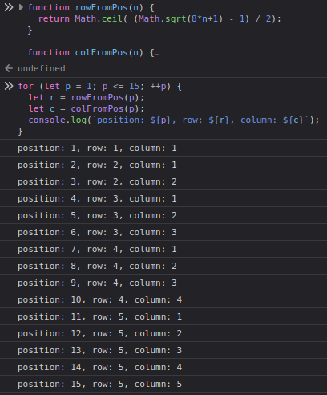
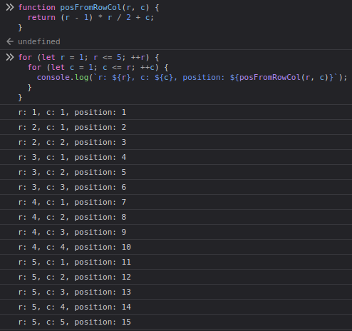
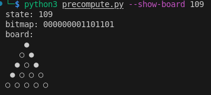
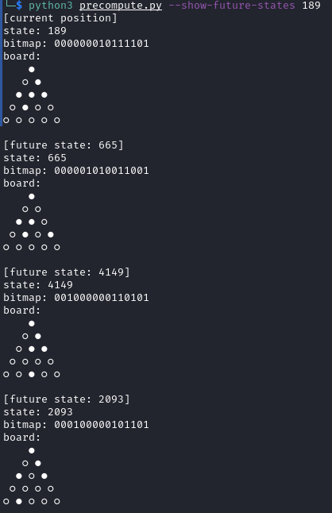

# Developer notes

Current status: UI prototype is tuned; Vite/React scaffold is up with Board/Hole/Peg components and refreshed styling; Python precompute utility now emits `states.json` for the full 15-bit state space. Next focus is wiring game logic, rendering, and controls for a deployable Vercel build.

## Repository layout
```
triangle-peg-game-react/
├─ README.md              # project overview + rules
├─ NOTES.md               # you are here
├─ precompute/            # Python helper that generates states.json
│  └─ precompute.py
├─ prototype/             # static HTML/CSS layout prototype
│  └─ triange_peg_game_ui_prototype.html
├─ img/                   # reference photos + prototype snapshot
└─ tpg-spa/               # Vite React app
   ├─ src/App.jsx         # root component
   ├─ src/components/     # Board/Hole/Peg scaffolding
   ├─ public/             # static assets
   └─ ...                 # Vite config, npm metadata
```

## Initial project setup
```bash
npm create vite@latest tpg-spa -- --template react
cd tpg-spa
npm install
npm run dev
```

## Game representation
- 15 holes → use a 15-bit mask (`1` = peg present).
- Hole indexing: top to bottom, left to right within each row (0..14). Lock this into a shared constant.
- Legal moves: static list of `{ from, over, to }` triples that conform to the triangle adjacency; reuse for validation and highlighting.
- Apply move: clear `from` and `over`, set `to`; push prior mask to history for undo.
- Optional: Python script to precompute the reachable state set and emit a JS module if needed; on-the-fly validation from the static move list is already cheap.

## Coordinate mapping (1-based, closed-form)
Total holes `N` follow the triangle number formula `N = R(R+1)/2`, so for the 15-hole board `R=5` rows.

- Row from position:  
  $$r(N,n) = \left\lceil \frac{\sqrt{8n+1}-1}{2} \right\rceil$$
- Column from position (given `r` above):  
  $$c(N,n) = n - \frac{(r-1)r}{2}$$

Examples with `N=15`: `r(15,5)=3`, `c(15,5)=2`; `r(15,15)=5`, `c(15,15)=5`.

Reverse mapping (position from row/column):
$$p(N,r,c) = \frac{(r-1)r}{2} + c$$
For `N=15`, `p(15,3,2)=5`.

See: [Triangular number (Wikipedia)](https://en.wikipedia.org/wiki/Triangular_number)

Position to (row, column) in JavaScript:

```js
function rowFromPos(n) {
  return Math.ceil( (Math.sqrt(8*n+1) - 1) / 2);
}

function colFromPos(n) {
  return n - ((rowFromPos(n) - 1) * rowFromPos(n)) / 2;
}
```

Sanity check:

```js
for (let p = 1; p <= 15; ++p) {
  let r = rowFromPos(p);
  let c = colFromPos(p);
  console.log(`position: ${p}, row: ${r}, column: ${c}`);
}
```



(row, column) to position in JavaScript:

```js
function posFromRowCol(r, c) {
  return (r - 1) * r / 2 + c;
}
```

Sanity check:

```js
for (let r = 1; r <= 5; ++r) {
  for (let c = 1; c <= r; ++c) {
    console.log(`r: ${r}, c: ${c}, position: ${posFromRowCol(r, c)}`);
  }
}
```



## Precompute utility

A Python script that precomputes the game states and exports to JSON.

state2ascii:



Next possible future states of state 189:




## Planned components (tpg-spa/src)
- `Board` renders the triangular grid, accepts `boardMask`, `selected`, `legalTargets`, and click handlers.
- `Hole` renders a single position (peg or empty) and highlights when selectable/targetable.
- `Controls` hosts reset/undo and any “show moves” toggle.
- `StatusBar` shows peg count, move availability, and solved/no-move messages.
- Logic helpers in `logic/` (e.g., `moves.js`, `boardUtils.js`) stay pure and do not touch React state directly.

## Prototype reference
- [UI prototype](prototype/triange_peg_game_ui_prototype.html) captures the sizing, spacing, and clip-path for the board/peg layout. The React components should mirror these proportions.
- Snapshot: [Prototype snapshot](img/tpg--ui-prototype.png).

## Implementation plan (current focus)
1) Bitmask utilities + static move list (JS module) to pair with the precomputed `states.json`.
2) Wire Board/Hole/Peg to render from the bitmask and surface click events.
3) Move application, selection + legal target highlighting, peg count, and history/undo.
4) Animations and responsive polish; match the prototype spacing.
5) Status/controls UI, README/docs refresh, and Vercel-ready build check.

## Deployment target
- Vercel static hosting using `npm run build` output from Vite. Keep assets relative and avoid server-only APIs.
