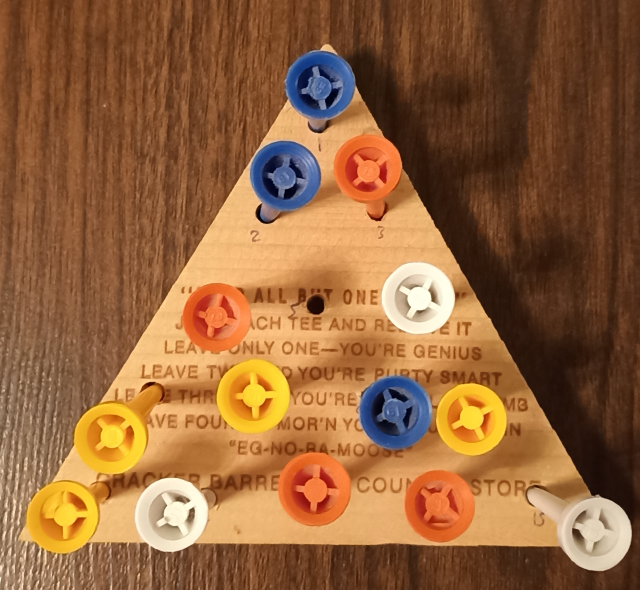

# triangle-peg-game-react

React single-page implementation of the triangle peg game (aka triangular peg solitaire). I first came across this game at a Cracker Barrel in Florida:



## What I’m building
- Interactive triangular board with 15 holes: click/tap pegs to highlight legal jumps, animate moves, and remove jumped pegs.
- Undo/reset controls, peg count, and status messaging (moves left / solved).
- Responsive layout tuned via the static prototype in [UI prototype](prototype/triange_peg_game_ui_prototype.html).
- Pure game logic helpers (bitmask-based) separated from UI components; optional Python generator to precompute reachable states.
- Target hosting: Vercel static deploy of the Vite build (`tpg-spa`).

## Quick start
```bash
cd tpg-spa
npm install
npm run dev    # starts Vite dev server
```

## References
- Development plan: [Developer notes](NOTES.md)
- Design brief: [Design brief](DESIGN.md)
- Prototype: [UI prototype](prototype/triange_peg_game_ui_prototype.html)

## Rules of the triangle peg game
- **Board & start:** 15 holes arranged as a triangle (rows of 1, 2, 3, 4, 5). Place a peg in every hole except one; the empty hole is the starting gap.
- **Legal move:** Choose a peg that has an adjacent peg with an empty hole directly on the opposite side, then jump over the adjacent peg into that empty hole. The jumped peg is removed. Jumps follow straight lines along the triangle edges/diagonals (up to six directions from most positions).
- **Turn flow:** Move one peg per turn. After a jump, the landing hole becomes occupied, the origin hole becomes empty, and the jumped peg is removed, creating a new empty hole for the next move.
- **Goal:** Keep jumping and removing pegs until only one peg remains on the board. Ending with two pegs is respectable; one peg is the perfect solve.
- **End of game:** The game ends when no legal jumps remain or when only one peg is left. If no legal jumps remain and more than one peg is on the board, the puzzle is unsolved.
