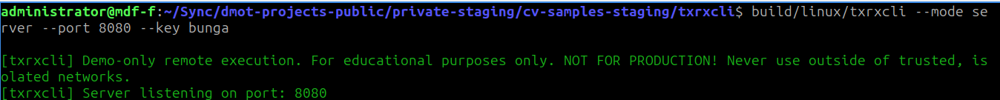
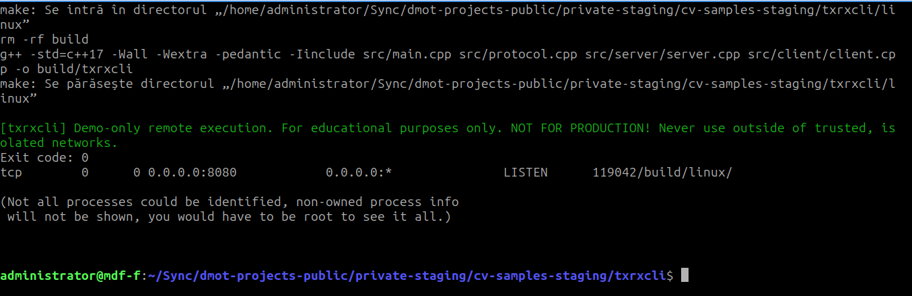

# txrxcli

An intentionally small, raw-TCP demo that lets a Linux box and a Windows box send authenticated commands to each other for learning purposes only. It is **not** hardened, **not** for production, and should only be run on an isolated, trusted network.

## What lives here
- `linux/`: C++ dual-mode client/server binary (raw TCP, API-key gated). Server and client modes are working.
- `windows/`: future C# client/server mirror.
- `docs/`: protocol notes, security caveats, and usage examples.
- `NOTES.md`: personal plan/status for this portfolio project.

## Navigation
- [Linux README](linux/README.md)
- [Windows README](windows/README.md)
- [Docs](docs/README.md)
- [Developer notes](NOTES.md)

## Safety first
This project executes arbitrary commands. Use throwaway machines or VMs on a closed network. Do **not** expose it to the internet or rely on it for remote administration. It exists solely to show cross-platform socket programming and simple authentication.

## Build and test (Linux)
- Native make (no CMake): `make -C linux`
- CMake alternative: `cmake -S linux -B linux/build -DCMAKE_BUILD_TYPE=Release && cmake --build linux/build --target txrxcli`
- Tests (require `libgtest-dev`, `libspdlog-dev`, `libfmt-dev`): `make -C linux test`  
  Tests use `socketpair` and may be blocked in restricted sandboxes.

## Screenshots

Server:

Remote execution:

