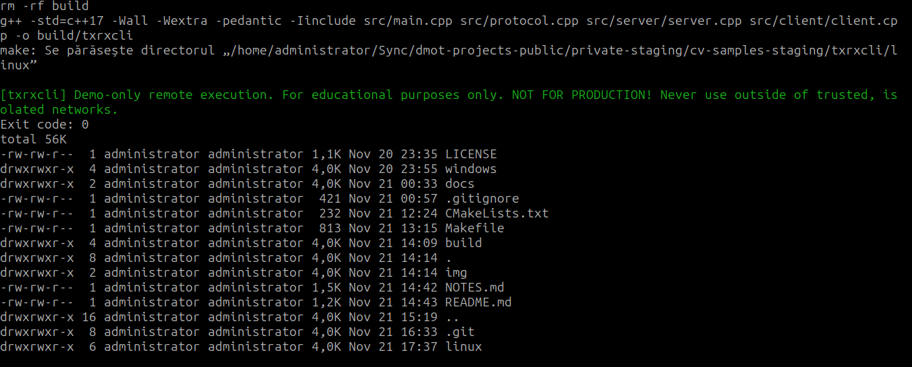

# Linux Development Notes

**Navigation:** [Linux README](README.md) · [Project README](../README.md) · [Docs](../docs/README.md) · [Windows notes](../windows/NOTES.md)

## Stage
- Server mode is implemented: binds/listens, decodes framed requests, enforces API key, executes commands, and returns exit code/stdout/stderr.
- Client mode is implemented: resolves hostnames or numeric addresses, frames requests, and prints exit code/stdout/stderr.
- Protocol helpers are shared in `protocol.hpp/.cpp`.

## Plan
- Harden client/server error handling and add simple usage examples to the READMEs.
- Keep tests green; consider a buffer-based decode helper to allow unit tests to run in restricted environments that block `socketpair`.
- Add small CLI usability tweaks (clearer errors, maybe retries) and verify hostname resolution on both IPv4/IPv6.

## Notes
- Build options: native `make -C linux` (no CMake) or CMake under `linux/`.
- Tests need `gtest`, `spdlog`, and `fmt`; they use `socketpair` and may be blocked in constrained sandboxes.
- HTTP is intentionally deferred; this branch focuses solely on raw TCP for clarity in the portfolio.

## Screenshots

Client access:

Telnet access:

