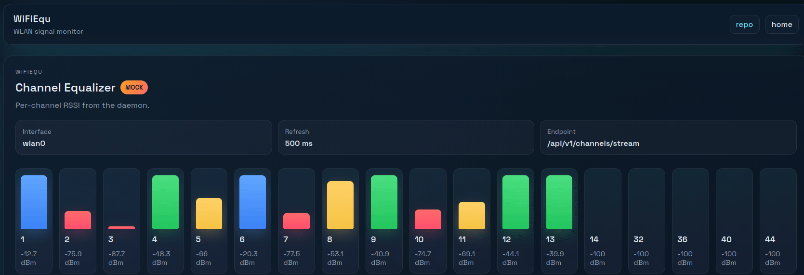
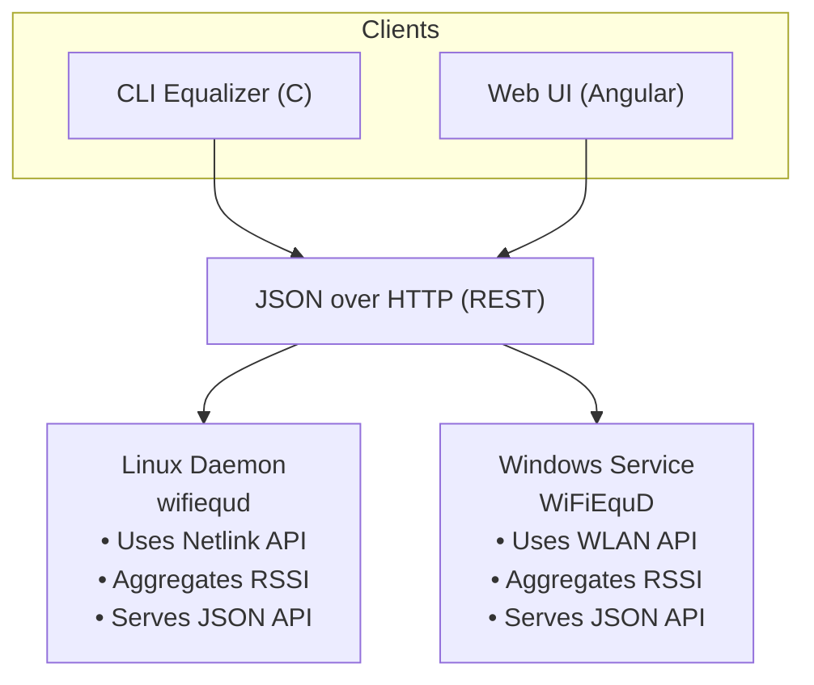

# WiFiEqu

Wi-Fi channel “equalizer” visualizer — a compact, cross-platform project that reads Wi-Fi scan data and displays a live bar-chart view of channel strength in the terminal or browser.

## Purpose
WiFiEqu demonstrates how system services on different operating systems can expose identical JSON APIs for local hardware data, while sharing common client visualizations.

## What it does (in plain terms)
- Scans for nearby Wi‑Fi networks and groups them by channel.
- Aggregates signal strength into a simple per‑channel bar view (“equalizer”).
- Exposes a minimal JSON API so other clients (CLI, Windows desktop, Angular web) can display the same data.,

## Example (mock mode)



## Project overview
- [Linux daemon](linux/README.md) — daemon and CLI (C, Makefiles, systemd unit install).
- [Windows service](windows/README.md) — Windows service (C#) (stub).
- [Angular frontend](web-angular/README.md) — Angular client with live SSE stream rendering.
- [API specification](api/README.md) — API schemas and examples.

## Architecture




- **Daemon (Linux, `wifiequd`)**: runs as a systemd service, polls Wi‑Fi, exposes JSON endpoints.
- **CLI client (C)**: renders a live terminal equalizer.
- **Windows service (C#)**: scans Wi-Fi and exposes JSON endpoints.
- **Web client (Angular)**: browser visualization that consumes the JSON API.

## Status
- Linux daemon publishes live or mock readings, honours `refresh.millis` from `wifiequd.conf`, and offers snapshot, metadata, and streaming endpoints via HTTP.
- HTTP router serves `GET /api/v1/channels`, `GET /api/v1/stats` (guarded by an API key), and the Server-Sent Events stream for live updates.
- Angular frontend renders the live stream, fills gaps for missing bins, and colour-codes signal strength; it proxies through nginx to inject the stats API key.
- Windows service remains a stub; shared .NET DTOs and parity are queued up next.

## Build
```sh
make clean all              # or simply: make
make docs                   # regenerate API docs when needed

# Alternative: CMake (Linux daemon)
cmake -S linux -B linux/build -G Ninja && cmake --build linux/build --target wifiequd
```

> Note: Documentation is no longer generated as part of `make`/`make all`; run `make docs` explicitly whenever the HTML needs to be refreshed.

## Install (optional)
```sh
sudo make setup-user        # create the 'wifiequ' system user and group
sudo make install           # installs config, unit file, and binary
```

## Test & Demos
```sh
make tests                  # builds the tests
make examples               # builds the examples
make test                   # runs the unit tests
make example-demo           # runs the demos

# CMake equivalents (Linux daemon)
cmake --build linux/build --target wifiequ_tests    # after configuring above
```

> Notes: Linux build depends on the local `libdmotservices` C artifacts. See that project’s README for building the library first.
> The `ex_wlanscan` demo expects a live wireless interface (defaults to `wlan0`). In CI and other headless environments the workflow exports `WFQ_MOCK=1`, so the binary exits early with a friendly message instead of attempting a hardware scan.

## Docker & Compose

Launch the mock-mode daemon in a container (build context is the repository root):

```sh
docker build -t wifiequ -f wifiequ/Dockerfile .
docker run --rm -p 8080:8080 wifiequ
```

Override configuration tokens or toggle live mode via environment variables:

```sh
docker run --rm -p 8080:8080 \
    -e WFQ_MOCK=0 \
    -e WFQ_IFACE=wlp2s0 \
    -e WFQ_ACCESS_TOKEN=customtoken123 \
    wifiequ
```

The image generates a stats token automatically when `WFQ_ACCESS_TOKEN` is omitted and logs the value at startup.

When building the container the Dockerfile compiles only the Linux C library (`make -C libdmotservices/c/linux ...`) before building WiFiEqu, avoiding the optional Java tooling from the host toolchain.

Run WiFiEqu alongside the other samples via Docker Compose:

```sh
docker compose up --build wifiequ-backend wifiequ-frontend
```

The API binds to `http://localhost:8084` and the Angular UI to `http://localhost:8085`. Compose bakes in a demo token (`wfq-demo-token-please-change`) for the stats endpoint; override `WFQ_ACCESS_TOKEN`/`WFQ_STATS_KEY` in `docker-compose.yml` or via environment variables for anything beyond a local demo. You can start/stop just these services (`docker compose stop wifiequ-backend wifiequ-frontend`) or watch the logs (`docker compose logs -f wifiequ-backend`). See the shared [Docker stack notes](../docker/README.md) for more examples and the Docker snap setup.

Angular build note: the frontend build expects Node.js 20+. The Dockerfile installs Node 20 in the builder stage; local builds should use the same or newer.

Ring-buffer behaviour for the streaming endpoint is covered by `linux/tests/test_sample_stream.c`, including fast-producer/slow-consumer edge cases.

## JSON API
- ✅ `GET /api/v1/channels` — returns the latest buffered sample.
- ✅ `GET /api/v1/stats` — exposes mode, interface (when live), refresh cadence, and configured channel bins (requires `X-API-Key`).
- ✅ `GET /api/v1/channels/stream` — Server-Sent Events feed for live updates.

The OpenAPI contract lives in [`api/openapi.yaml`](api/openapi.yaml). The HTML version at [`docs/api/index.html`](docs/api/index.html) is produced on demand via the root `make docs` target, which will fetch `@redocly/cli` if it is not already installed. Prefer the hosted preview at [cv-samples.vercel.app/wifiequ/docs/api](https://cv-samples.vercel.app/wifiequ/docs/api) for a live rendering (implemented vs. planned routes are flagged in the spec). See also the short guide in [`docs/README.md`](docs/README.md).

## Roadmap
- [ ] Lock down the JSON schema and add contract tests (Linux + Windows).
- [ ] Ship the first Windows worker: Minimal API, SSE endpoints, API-key auth, xUnit coverage.
- [ ] Extract the shared `Dmot.Lib` C# package for DTOs, logging, and config.
- [ ] Extend Docker Compose stack with the Angular UI, gallery landing page, and container health checks/metrics. **(Angular UI added; health checks/metrics still pending.)**
- [ ] Harden OpenAPI docs and CI build job to emit Linux/Windows artifacts.
- [ ] Enhance Angular visualization with channel overlays and live stream handling.
- [ ] Polish packaging/installer scripts once multi-platform parity is in place.

## Related
- Back to [portfolio overview](../README.md)
- Developer notes: [NOTES.md](NOTES.md)
- Underlying equalizer lives in [libdmotservices](../libdmotservices/README.md)

## License
See `/LICENSE` in the repository root.
