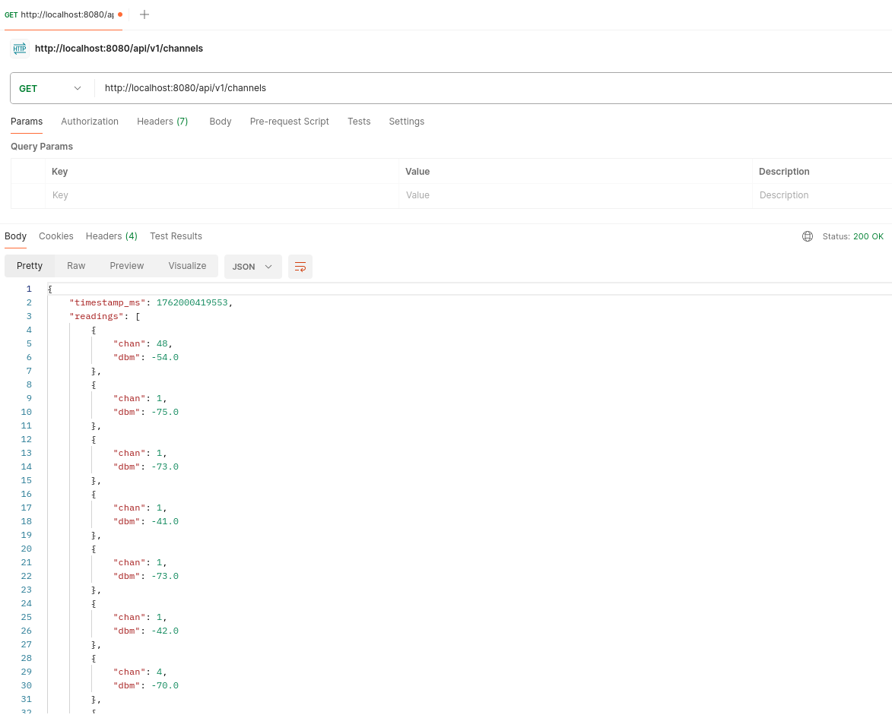
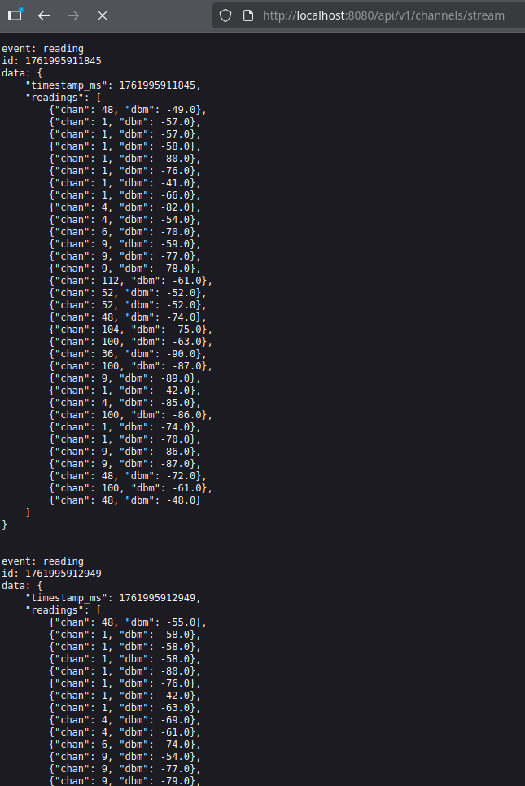
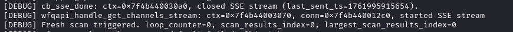
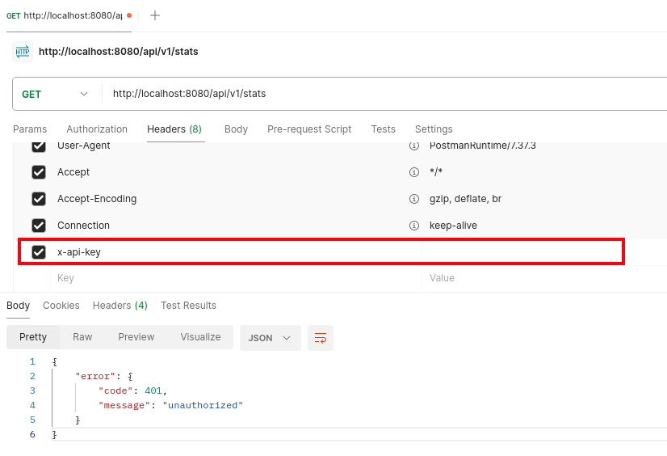
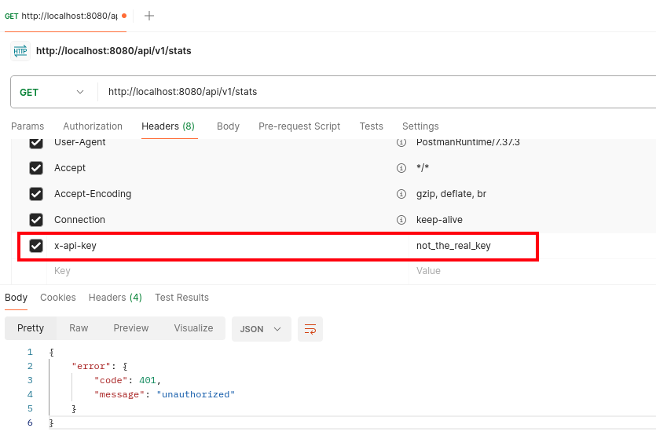
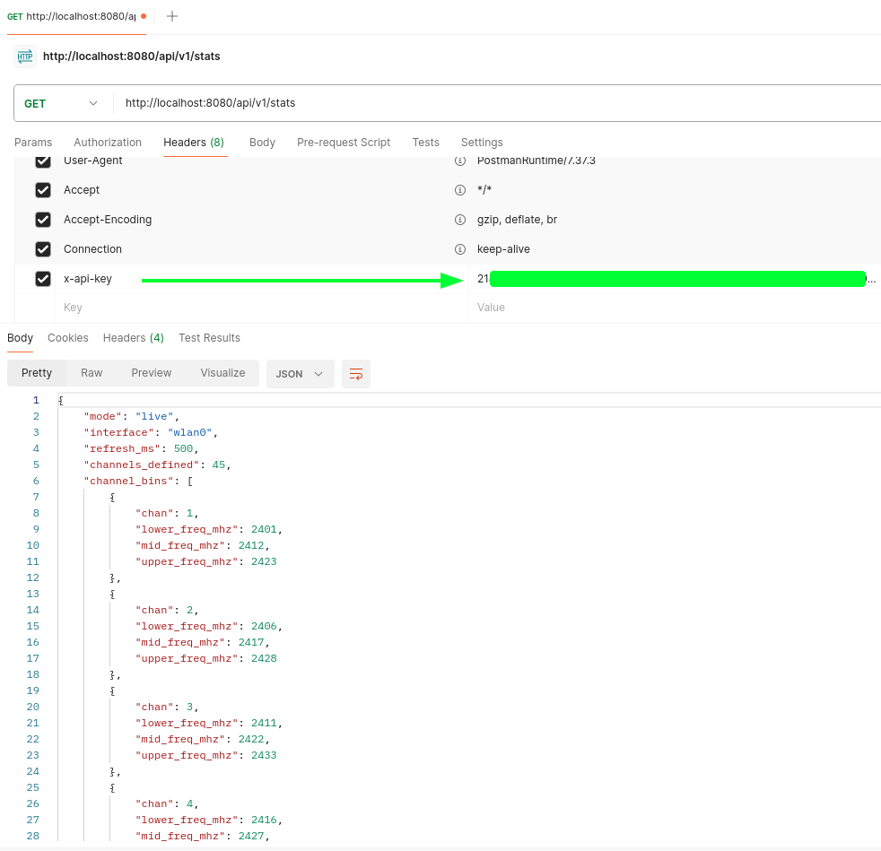
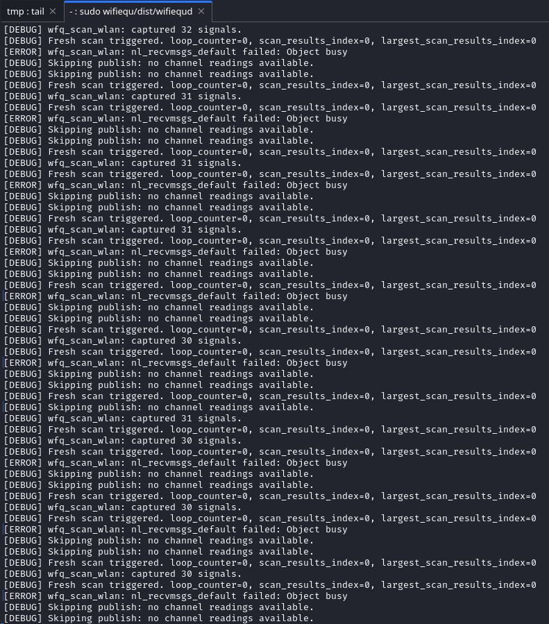

# WiFiEqu (API)

Authoritative contract for the daemon’s HTTP surface.

## Specification
- Source (GitHub): [`openapi.yaml`](openapi.yaml)
- Pre-rendered docs (local): [`../docs/api/index.html`](../docs/api/index.html) – regenerate by running the root `make docs` target (auto-installs `@redocly/cli` when needed; no longer part of `make all`)
- Live preview: [cv-samples.vercel.app/wifiequ/docs/api](https://cv-samples.vercel.app/wifiequ/docs/api)

## Endpoints
- ✅ `GET /api/v1/channels` → most recent channel aggregates (implemented)
- ✅ `GET /api/v1/stats` → daemon metadata and config summary (requires `X-API-Key`)
- ✅ `GET /api/v1/channels/stream` → Server-Sent Events feed of channel readings (implemented)

Contract changes should update both the YAML and the generated HTML so clients and ops have a consistent view.

## Status
- `GET /api/v1/channels`, `GET /api/v1/stats`, and the SSE stream are live in the Linux daemon; all honour `log.daemon.json` for optional JSON logging.
- `/api/v1/stats` now enforces an API key through the `X-API-Key` header (`access.token.stats` in `wifiequd.conf`).
- `/api/v1/channels` and the SSE stream remain open for public access.
- Schema linting and contract tests remain on the roadmap.

## Related
- Back to [WiFiEqu overview](../README.md)
- Implementation details live in the [Linux daemon docs](../linux/README.md)
- Developer notes: [NOTES.md](NOTES.md)

## Screenshots

Endpoint screenshots.

### GET /api/v1/channels

JSON output:

### GET /api/v1/channels/stream

Stream output:

Daemon log (hardware mode):

## GET /api/v1/stats

JSON output (unauthorized access, empty API key):

JSON output (unauthorized access, incorrect API key):

JSON output (authorized access):

Daemon log (hardware mode):

