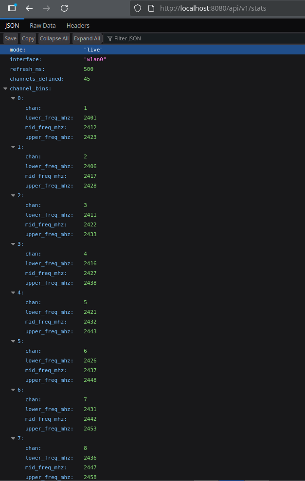

# WiFiEqu (API)

Authoritative contract for the daemon’s HTTP surface.

## Specification
- Source (GitHub): [`openapi.yaml`](openapi.yaml)
- Pre-rendered docs (local): [`../docs/api/index.html`](../docs/api/index.html) – regenerate by running the root `make docs` target (auto-installs `@redocly/cli` when needed; no longer part of `make all`)
- Live preview: [cv-samples.vercel.app/wifiequ/docs/api](https://cv-samples.vercel.app/wifiequ/docs/api)

## Endpoints
- ✅ `GET /api/v1/channels` → most recent channel aggregates (implemented)
- ✅ `GET /api/v1/stats` → daemon metadata and config summary (implemented)
- ⏳ `GET /api/v1/channels/stream` → Server-Sent Events feed of channel readings (planned)

Contract changes should update both the YAML and the generated HTML so clients and ops have a consistent view.

## Status
- `GET /api/v1/channels` and `GET /api/v1/stats` are live in the Linux daemon; both honour `log.daemon.json` for optional JSON logging.
- SSE remains staged in the contract; handlers will land once the streaming transport is ready.
- Header-based API keys are documented but not yet enforced, so clients can call endpoints without credentials until that future milestone lands.
- Schema linting and contract tests remain on the roadmap.

## Related
- Back to [WiFiEqu overview](../README.md)
- Implementation details live in the [Linux daemon docs](../linux/README.md)

## Screenshots

Endpoint screenshots.

### GET /api/v1/channels

JSON output:

## GET /api/v1/stats

JSON output:

## Journal

Daemon log (hardware mode):

