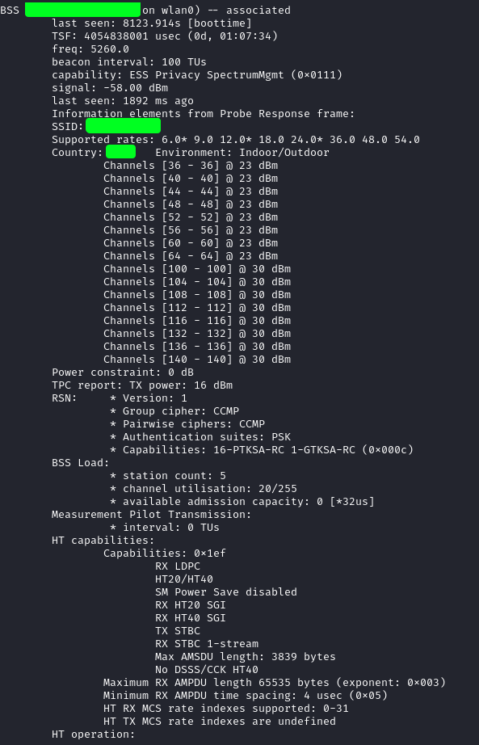
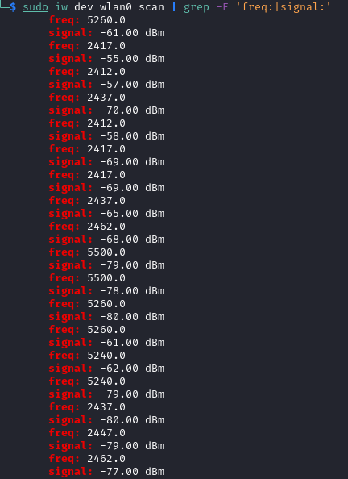
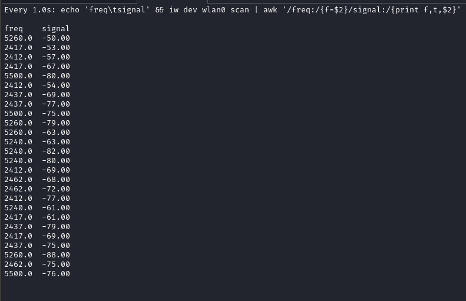

# NOTES

Developer notes for the Linux reference implementation (`wifiequd` + CLI demos). Use this file to track the feature roadmap, runtime considerations, and wireless tooling cheatsheets gathered while building the daemon.

## Current stage
- Daemon, HTTP façade, and CLI demos are portfolio-ready: live/mock sources ship today, and installer/scripts are exercised in CI.
- Ongoing work focuses on scanner resiliency, SSE polish, and packaging niceties so the Linux build can continue guiding the Windows/Angular parity efforts.

## Current File Layout
```
linux/
├─ README.md                     # Build/run instructions for Linux daemon
├─ NOTES.md                      # Developer roadmap and references
├─ ARCHITECTURE.md               # Detailed component diagram
├─ Makefile                      # gcc build + install targets
├─ etc/
│  ├─ wifiequd.conf              # Sample configuration
│  └─ systemd/
│     └─ system/wifiequd.service # Service unit template
├─ include/
│  ├─ wifiequd.h                 # Daemon public header
│  ├─ wfq/*.h                    # Signal processing headers
│  └─ wfqapi/**/*.h              # HTTP endpoint interfaces
├─ src/
│  ├─ README.md
│  ├─ wifiequd.c                 # Daemon entry point
│  ├─ wfq/
│  │  ├─ config/config.c         # Configuration loader
│  │  └─ wlan/{wifisignal.c, wlanscan.c}
│  └─ wfqapi/
│     ├─ http.c / json.c / router.c
│     └─ endpoints/{channels.c, channels_stream.c, stats.c}
├─ tests/
│  ├─ README.md
│  ├─ test_sample_stream.c
│  └─ test_version.c
├─ examples/
│  ├─ README.md
│  └─ ex_wlanscan.c              # CLI equalizer demo
├─ img/
│  ├─ README.md
│  ├─ wfq-bss-01.png
│  ├─ wfq-daemon-readings--live.png
│  └─ wfq-freq-signal-*.png
└─ logs/                         # Sample daemon logs (gitignored content)
```

## Implementation Plan
1. **Scanner reliability**  
   - Finalise retry/backoff strategies in `src/wlan/wlanscan.c` for busy/locked interfaces.  
   - Harden error surfacing in the daemon log (structured fields so the Angular client can reflect degraded health states).  
   - Expand unit coverage around channel bin mapping (`wfq_config_freq2chan`) with fixtures for 2.4 GHz and 5 GHz overlaps.
2. **HTTP façade polish**  
   - Exercise ring-buffer saturation tests (fast producer, slow SSE consumer) and expose metrics in `/api/v1/stats`.  
   - Add CLI flag/env to rotate the API key and reload the daemon without downtime; mirror in the sample configuration.  
   - Document SSE reconnect behaviour and heartbeat cadence for frontends.
3. **CLI demo UX**  
   - Extend `examples/ex_wlanscan.c` to print metadata (interface, refresh cadence, mock/live status) above the equalizer.  
   - Include optional CSV logging for replay/testing scenarios.  
   - Synchronise the demo output with the daemon’s JSON log for screenshot consistency.
4. **Packaging & service flow**  
   - Keep `make install` idempotent (service user/group checks, config diffs).  
   - Provide a teardown target that disables the unit and removes installed binaries for cleanup.  
   - Ship sample `journalctl` filters in the docs so operators can follow only WiFiEqu logs.

## Runtime Mechanics
- **Data pipeline**: `wfq_scan_wlan` pulls BSS data via `libnl`, normalises readings into `wfq_signal[]`, and the daemon maps each sample to a configured channel before writing JSON to the ring buffer.  
- **Configuration**: `etc/wifiequd.conf` defines labelled bins (e.g., `ch149=5745-5765`) that the equalizer hides/shows; keep labels in sync with the Angular legend.  
- **Endpoints**: `GET /api/v1/channels` (public), `GET /api/v1/stats` (API key), and `GET /api/v1/channels/stream` (SSE) are implemented in `src/wfqapi/http.c`. Update `api/openapi.yaml` alongside any behavioural tweaks.  
- **Mock mode**: `WFQ_MOCK=1` swaps `wlanscan` for `src/mock/mocksignal.c`. Tests rely on this path, so new features must honour the flag.  
- **Logging**: `log.daemon.json=1` mirrors every JSON payload; keep structured fields stable for downstream tooling.

## Implementation Timeline
- **2025-10-20 – 2025-10-24: Mock foundations & configuration**  
  Early days focused on a mock signal generator and daemon polling loop, followed closely by configuration parsing and interface guards so the daemon honoured `wifiequd.conf`.
- **2025-10-24 – 2025-10-26: wlanscan bring-up & equalizer integration**  
  The wlanscan skeleton matured through refactors that stabilised memory management, callbacks, and error handling. Live equalizer output shipped once the daemon linked against updated libdmotservices builds, and guardrails kept channel mappings safe.
- **2025-10-27 – 2025-11-02: Production hardening**  
  Defensive coding, configuration-driven interface selection, and expanded documentation landed alongside JSON logging controls. HTTP façade work, ring buffer tests, SSE streaming, installer polish, and Dockerisation closed the loop with mock-mode protections for predictable demos.

## Field Reference

### dBm refresher

dBm expresses power relative to 1 milliwatt (mW).
- 0 dBm = 1 mW
- 10 dBm = 10 mW
- 20 dBm = 100 mW
- −10 dBm = 0.1 mW

$$
dBm = 10 \cdot \log_{10}\left(\frac{P}{1\ \text{mW}}\right)
$$

### wifiequd JSON sample

```json
{
  "timestamp_ms": 1734760118123,
  "readings": [
    {"chan": 1, "dbm": -25.0},
    {"chan": 2, "dbm": -20.0},
    {"chan": 7, "dbm": -50.3}
  ]
}
```

### Wireless tooling snippets

```bash
ip a                       # confirm interface names (expect wlan0/wlp2s0)
sudo iw dev wlan0 scan     # full scan output (BSS blocks)
```



Extract only the frequency/signal pairs:

```bash
sudo iw dev wlan0 scan | grep -E 'freq:|signal:'
```



Live watch with minimal formatting:

```bash
sudo watch -n 1 "echo 'freq\tsignal' && iw dev wlan0 scan | awk '/freq:/{f=$2}/signal:/{print f,\"\t\",$2}'"
```



## Reading Materials

- [GNU Libmicrohttpd](https://www.gnu.org/software/libmicrohttpd/)
- [Linux Wireless documentation](https://wireless.docs.kernel.org/en/latest/en/developers/documentation/nl80211.html)
- [Stack Overflow: How do the nl80211 library & cfg80211 work?](https://stackoverflow.com/questions/21456235/how-do-the-nl80211-library-cfg80211-work) — architecture primer.
- [Wikipedia: Circular buffer](https://en.wikipedia.org/wiki/Circular_buffer) — ring buffer structure referenced in the SSE implementation.
- [Wikipedia: List of WLAN channels](https://en.wikipedia.org/wiki/List_of_WLAN_channels) — frequency ranges for config validation.
- [Wikipedia: Netlink](https://en.wikipedia.org/wiki/Netlink) — userspace/kernel messaging background.

## Related

- Back to [WiFiEqu (Linux)](README.md)
- [Architecture overview](ARCHITECTURE.md)
- [Examples](examples/README.md)
