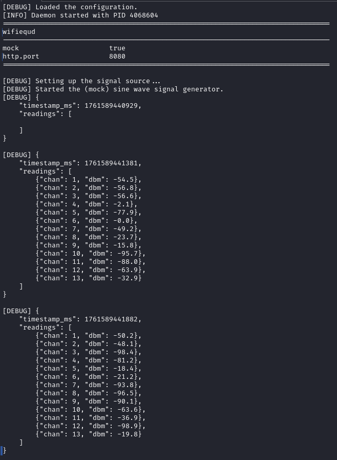
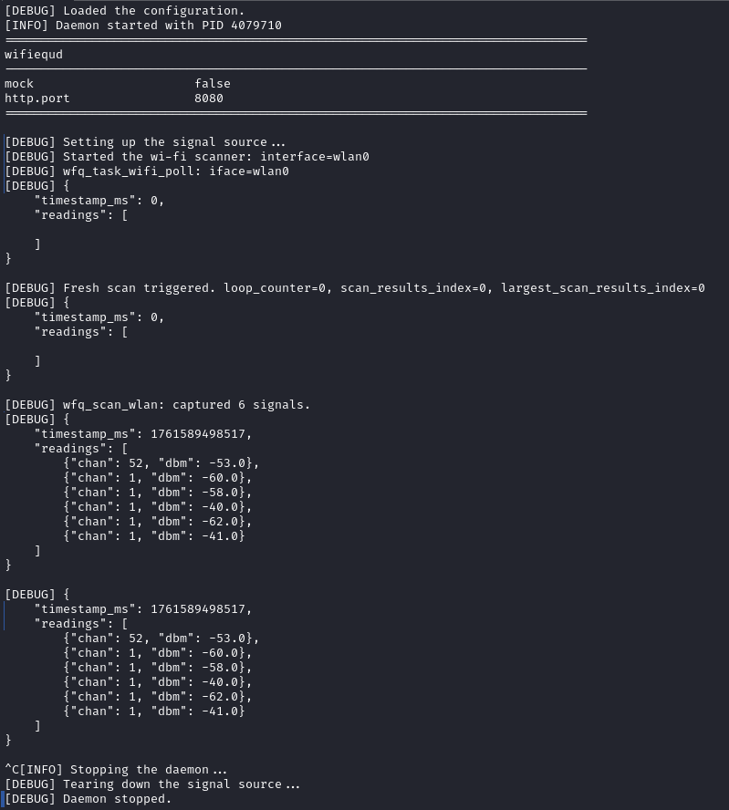

# WiFiEqu (Linux)

WiFiEqu is a console-first Wi-Fi spectrum monitor for Linux.  
It pairs a scanning daemon (`wifiequd`) with ANSI-rendered visualisations powered by the `libdmotservices` equalizer.

- [Architecture overview](ARCHITECTURE.md)
- [Example walkthroughs](examples/README.md)
- [Development notes](NOTES.md)

## Quick start

### Prerequisites
```bash
sudo apt update
sudo apt install -y build-essential libcmocka-dev \
     libmicrohttpd-dev libnl-3-dev libnl-genl-3-dev
```

### Build
```bash
make            # builds the daemon, library, and examples
make clean all  # full rebuild
```

### Run the demos
```bash
make examples       # builds CLI examples, including ex_wlanscan
make example-demo   # launches the highlight demos
```

Artifacts land in `bin/`, logs in `logs/`.

### Try the HTTP endpoint
```bash
./bin/wifiequd &
curl -s http://localhost:8080/api/v1/channels | jq
curl -s -H "X-API-Key: $(grep access.token.stats /etc/wifiequd.conf | cut -d= -f2)" \
    http://localhost:8080/api/v1/stats | jq
curl -s http://localhost:8080/api/v1/channels/stream
```

Set `log.daemon.json=1` in `etc/wifiequd.conf` to mirror each payload in the daemon log.
Adjust `refresh.millis` to slow down or speed up the sampler; both mock and live sources honour the value (numbers <1 fall back to the default 500 ms, practical range in the hundreds).

## Optional systemd install

The helper target installs a service unit and ensures the `wifiequ` user/group exist:

```bash
sudo make setup-user       # create service account
sudo make install          # install binaries, config, and systemd unit
sudo systemctl enable --now wifiequd
```

Remove with `sudo make uninstall`.

## Core components

- **Daemon (`src/wifiequd.c`)** – gathers Wi-Fi samples, publishes JSON, and optionally serves HTTP via libmicrohttpd (mock/live sources).
- **Scanner (`src/wlan/wlanscan.c`)** – drives `nl80211` via libnl, aggregates the strongest signal per configured channel bin, and exposes the results to the UI.
- **Configuration (`src/config/config.c`)** – parses `etc/wifiequd.conf`, validates channel ranges, and maps frequencies to Wi-Fi channels.
- **Equalizer UI (`examples/ex_wlanscan.c`)** – renders live channel strengths using the reusable terminal equalizer from libdmotservices.
- **HTTP server (`src/wfqapi/http.c`)** – manages a monotonic ring buffer for streaming samples, wraps libmicrohttpd startup/shutdown, and backs `GET /api/v1/channels` plus `GET /api/v1/stats`.
- **Unit tests (`tests/test_sample_stream.c`)** – exercise the sample-stream buffer with fast-producer/slow-consumer scenarios.

See [ARCHITECTURE.md](ARCHITECTURE.md) for the data flow between these pieces.

## Screenshots

### Mock source



### Live source



## Related

- [Architecture overview](ARCHITECTURE.md)
- [Examples](examples/README.md)
- [Developer notes](NOTES.md)
- [API docs](../docs/README.md)
- Back to [WiFiEqu overview](../README.md)
