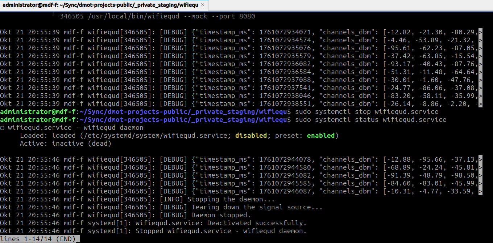

# WiFiEqu (Linux)

Builds the Linux daemon (`wifiequd`) and terminal client examples.

## Build Prerequisites
```bash
sudo apt update
sudo apt install -y build-essential libcmocka-dev libmicrohttpd-dev
```

## Build
```sh
make clean all              # or simply: make
```

## Install (optional)
```sh
sudo setup-user             # create 'wifiequ' user and 'wifieq' group
sudo make install           # creates user and group and installs systemd unit and binary
```

## Test & Demos
```sh
make tests                  # builds the tests
make examples               # builds the examples
make test                   # runs the unit tests
make example-demo           # runs the demos
```

Artifacts and logs are written under `bin/` and `logs/`.

## Screenshots


