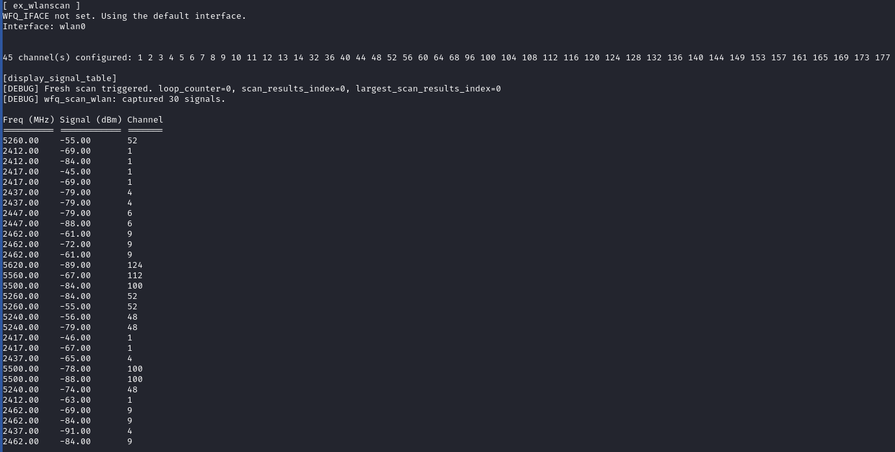

# WiFiEqu (Linux): Examples

Command line examples that ship with the Linux build.  
All binaries drop into `linux/bin/` after `make examples`.

## ex_wlanscan

Real hardware scanner that:

- triggers nl80211 scans via libnl,
- maps each `(frequency, dBm)` pair onto configured channel bins, and
- streams the strongest reading per channel into the `dmot_ui_equalizer`.

### Run it

```bash
cd linux
make examples
WFQ_IFACE=wlan0 ./bin/ex_wlanscan
```

Leave `WFQ_IFACE` empty to fall back to `wlan0`.

### What you’ll see

- A frequency/channel table for the latest scan:

  

- A live equalizer with per-channel labels sourced from `wifiequd.conf`:

  

The renderer hides unnamed channels, so you can focus on the configured bins.

---

For implementation notes, read [ARCHITECTURE.md](../ARCHITECTURE.md).
